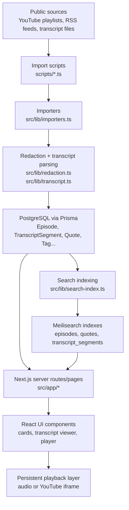
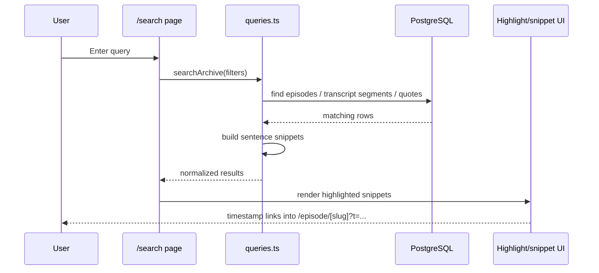

# Technical Architecture

This document explains how the CORNDOWN archive works as a system: app layers, storage, import and indexing flow, playback, search behavior, and deployment assumptions.

## Goals

- Index public CORNDOWN episodes and transcripts.
- Preserve redaction-first safety guardrails.
- Support timestamp-based navigation from search results into episode transcripts.
- Keep the public UI fast enough for browsing while preserving an admin/import workflow.

## High-Level Architecture

## Layer Breakdown

### 1. App shell and routing

The app is built with the Next.js App Router.

- `src/app/layout.tsx`
  - Global layout
  - Wraps the site in `AudioPlayerProvider`
  - Renders the persistent header and bottom player shell
- `src/app/page.tsx`
  - Search-first homepage
- `src/app/episodes/page.tsx`
  - Episode directory
- `src/app/episode/[slug]/page.tsx`
  - Episode detail page
  - Transcript view
  - Quote list
  - Playback entry point
- `src/app/search/page.tsx`
  - Search UI backed by Prisma queries
- `src/app/api/search/route.ts`
  - JSON API for search
- `src/app/admin/*`
  - Admin listing, audit views, and import entry UI

### 2. Presentation components

Reusable UI pieces live in `src/components`.

- `episode-card.tsx`
  - Summary card for episode lists
  - Entire content area is wrapped in a route link
- `quote-card.tsx`
  - Quote summary and permalink display
- `transcript-viewer.tsx`
  - Renders timestamped transcript rows
  - Syncs timestamp clicks into the persistent player
- `audio-player-provider.tsx`
  - Persistent bottom player state
  - Supports direct audio files and YouTube iframe playback
- `episode-play-button.tsx`
  - Normalizes episode playback startup from the detail page
- `highlighted-text.tsx`
  - Search-term highlighting for snippets and transcript text

### 3. Data access and business logic

The app keeps most domain logic in `src/lib`.

- `queries.ts`
  - Main read layer for homepage, episode pages, admin pages, and search
  - Contains demo-data fallback when `DATABASE_URL` is not set
- `importers.ts`
  - Public-source ingestion for RSS, YouTube metadata, transcript files, and YouTube captions
- `search-index.ts`
  - Pushes normalized documents into Meilisearch
  - Transcript indexing is batched to avoid loading the full corpus at once
- `playback.ts`
  - Converts an episode into a playable track
  - Supports direct audio URLs or YouTube video IDs
- `search-snippets.ts`
  - Search snippet extraction and highlight term logic
  - Multi-word queries are treated as phrase-style searches by default
- `redaction.ts`
  - Sensitive text cleanup before publication
- `transcript.ts`
  - JSON, VTT, and SRT parsing
- `timestamps.ts`
  - Timestamp parsing/formatting used in URLs and transcript rows
- `validation.ts`
  - Zod validation for import/admin inputs

## Data Model

The Prisma schema lives in `prisma/schema.prisma`.

Core tables:

- `Episode`
  - Canonical record for a public episode
  - Holds title, source type, source URL, optional direct audio URL, artwork, and timing info
- `TranscriptSegment`
  - Timestamped transcript rows for an episode
  - Stores raw `text`, `redactedText`, and `searchText`
- `Quote`
  - Curated notable moments, optionally linked to a transcript segment
- `Tag`
  - Shared taxonomy for episodes and quotes
- `Guest`
  - Co-host or guest metadata
- `AdminImportJob`
  - Import job bookkeeping
- `TranscriptImportAudit`
  - Per-episode caption import status

Join tables:

- `EpisodeTag`
- `QuoteTag`
- `EpisodeGuest`

### Why both `text`, `redactedText`, and `searchText` exist

- `text`
  - Raw imported or manually entered transcript text
- `redactedText`
  - Safe text intended for public display
- `searchText`
  - Search-oriented field, typically speaker plus redacted text
  - Lets search operate against sanitized content rather than raw content

## Request Flow

### Public page load

1. A route in `src/app/*` calls a function from `src/lib/queries.ts`.
2. `queries.ts` reads from Prisma when `DATABASE_URL` exists.
3. If there is no DB configured, it falls back to `demo-data.ts`.
4. The route passes hydrated data into UI components.
5. Transcript clicks and episode play actions feed the global player context.

### Search flow

Notes:

- Search currently uses Prisma-backed matching in live page/API queries.
- Meilisearch is populated as an external index, but the live public search page is not yet fully delegated to Meilisearch.
- Exact phrase behavior is implemented in app logic by `search-snippets.ts` and `queries.ts`.

## Import Pipeline

Import entry points are CLI scripts in `scripts/`.

- `import-rss.ts`
- `import-youtube.ts`
- `import-youtube-transcripts.ts`
- `import-transcript.ts`
- `index-search.ts`

### YouTube metadata import

1. `scripts/import-youtube.ts` calls `importYoutubeMetadata`.
2. The importer reads the playlist ID from the URL.
3. If `YOUTUBE_API_KEY` exists, it uses the YouTube Data API and paginates through the full playlist.
4. If not, it falls back to the public playlist feed.
5. `Private video` and `Deleted video` placeholder entries are skipped.
6. Episode metadata is upserted into `Episode`.

### YouTube transcript import

1. `scripts/import-youtube-transcripts.ts` calls `importYoutubeTranscriptsForSource`.
2. Matching episodes are selected from the database.
3. Existing transcript rows are skipped unless `--force` is supplied.
4. `YoutubeTranscript.fetchTranscript()` pulls caption text.
5. Each caption row is normalized into start/end seconds.
6. `redactSensitiveText()` creates safe display/search content.
7. Old segments are replaced and `TranscriptImportAudit` is updated.

### Local transcript file import

1. `import-transcript.ts` reads a local JSON, VTT, or SRT file.
2. `transcript.ts` parses the format.
3. Segments are redacted and stored via `replaceTranscriptSegments`.

## Search Indexing

The indexing job lives in `src/lib/search-index.ts`.

It pushes three logical document sets to Meilisearch:

- `episodes`
- `quotes`
- `transcript_segments`

Transcript rows are indexed in batches instead of one giant query. This matters because the transcript corpus is large enough that single-shot loading can become unstable in production-scale imports.

## Playback Model

Playback is handled by a persistent client-side context in `audio-player-provider.tsx`.

### Supported playback modes

- `audio`
  - For episodes with a direct `audioUrl`
  - Uses the native HTML `<audio>` element
- `youtube`
  - For YouTube episodes without a direct audio file
  - Uses the YouTube iframe API and video ID extracted from `sourceUrl`

### Playback track selection

`src/lib/playback.ts` decides what to do:

- If `audioUrl` exists, prefer direct audio playback.
- Else if `sourceType === YOUTUBE`, extract the video ID and use YouTube playback.
- Else there is no in-app playback track and the UI should fall back to the public source link.

### Timestamp sync

- Transcript row buttons call `setTrack()` or `seekTo()`.
- The bottom player updates `currentTime`.
- Transcript rows compute their active highlight based on `currentTime`.
- Deep links use `/episode/[slug]?t=HH:MM:SS`.

## Redaction and Safety Model

The system is designed so public rendering and search are based on redacted transcript content.

Important safety rules:

- Do not import private or paywalled material.
- Do not publish private numbers, addresses, or target-identifying data.
- Redaction should happen before content becomes public-facing.
- Search should operate on safe, public text, not raw sensitive text.

Current implementation note:

- Imported transcript segments preserve `text`, but public rendering and search use `redactedText` and `searchText`.

## Demo Fallback Mode

If `DATABASE_URL` is absent:

- `queries.ts` uses `demo-data.ts`
- the public UI still renders
- this is useful for local UI bootstrapping or previewing without infrastructure

Admin/import behavior still assumes a real database.

## Testing Strategy

### Unit tests

Located in `tests/unit`.

Current coverage includes:

- `timestamps.test.ts`
- `slug.test.ts`
- `redaction.test.ts`
- `transcript.test.ts`
- `playback.test.ts`

These cover foundational utility logic and low-level behavior.

### E2E tests

Located in `tests/e2e`.

Current smoke coverage includes:

- homepage rendering
- episode route generation from the homepage
- episode detail page playback controls

### Recommended future test layers

- Search result ranking and phrase behavior
- Transcript timestamp deep-link behavior
- Player state transitions for YouTube mode
- Admin transcript audit views
- Import job failure handling

## Deployment Topology

### Current intended production shape

- `Vercel`
  - Hosts the Next.js app
- `Neon` or another hosted PostgreSQL provider
  - Hosts the Prisma database
- `Meilisearch Cloud` or another hosted Meilisearch provider
  - Hosts the search indexes

### Required environment variables

- `DATABASE_URL`
- `MEILISEARCH_HOST`
- `MEILISEARCH_API_KEY`
- `YOUTUBE_API_KEY`
- `NEXT_PUBLIC_SITE_URL`

### Production bootstrap steps

1. Deploy the app to Vercel.
2. Run `npm run db:push` against the production database.
3. Run `npm run import:youtube -- <playlist-url>`.
4. Run `npm run import:youtube-transcripts -- <playlist-url>`.
5. Run `npm run search:index`.

Without step 2, the site will fail with missing-table Prisma errors. Without step 5, Meilisearch will exist but the indexes will be empty.

## Known Limitations

- Live search still relies primarily on Prisma queries rather than a dedicated Meilisearch query path.
- YouTube caption quality is inconsistent and can be noisy.
- Speaker diarization is not available from the imported YouTube captions.
- Admin editing and redaction tooling are still lightweight.
- Browser autoplay restrictions can affect immediate playback depending on source and user gesture context.

## File Guide

Useful starting points for new contributors:

- `prisma/schema.prisma`
  - database model
- `src/lib/queries.ts`
  - main data read layer
- `src/lib/importers.ts`
  - ingestion pipeline
- `src/lib/search-index.ts`
  - search indexing pipeline
- `src/lib/playback.ts`
  - playback track derivation
- `src/components/audio-player-provider.tsx`
  - persistent player behavior
- `src/app/episode/[slug]/page.tsx`
  - episode detail composition
- `tests/e2e/home.spec.ts`
  - smoke tests

## Change Guidance

When making changes, prefer this order of thought:

1. Decide whether the change belongs in route composition, a reusable component, or `src/lib`.
2. Keep imported/public text safety in mind before changing transcript rendering or search.
3. If adding new search behavior, update both matching and highlighting logic together.
4. If changing import behavior, update `TranscriptImportAudit` or other admin visibility so failures remain visible.
5. Add at least one unit or E2E test when a user-visible workflow changes.
